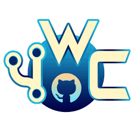
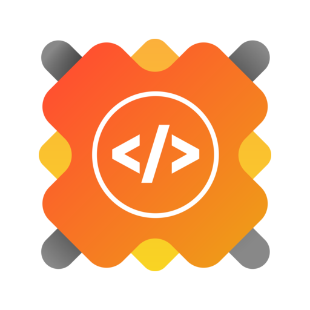

<div align="center">
  <h1>WordNook</h1>
  
</div>

<hr>
  
<div align="center">
 <h1>A sneak peek into what we have here</h1>
 
</div>

<hr>

<div align="center">

## About-

<!-- ALL-CONTRIBUTORS-BADGE:START - Do not remove or modify this section -->
<!-- DeepSource Badge and Dependabot Status badges -->
[](#contributors-)   [](https://github.com/ALPHAVIO/WordNook/issues) [](https://github.com/ALPHAVIO/WordNook/pulls)   
<!-- **DeepSource:** [](https://deepsource.io/gh/ALPHAVIO/WordNook/?ref=repository-badge) -->
<!-- ALL-CONTRIBUTORS-BADGE:END -->


- 'Blog' and 'blogging' are now loosely used for content creation and sharing on social media, especially when the content is long-form and one creates and shares content on regular basis.  

[](https://gitpod.io/#https://github.com/ALPHAVIO/WordNook)

- This is a dynamically updating Blog posting website developed primarily using Node Js with EJS template engine and Mongoose as ODM(Object Data Modeling library).  
[Visit website](https://word-nook.herokuapp.com/)

<hr>

## Tech Stack-

      

</div>

<hr>

## Environment Setup for local use-

* Drop a :star: on the GitHub repository.
<br/>

* Download [Git](https://git-scm.com/downloads) (when you install Git, Git Bash also gets installed by default)
<br/>

* Download and install a code/ text editor.
    - Recommended-
        - [Download VS Code](https://code.visualstudio.com/download)
        - [Download Atom](https://atom.io/)
<br/>

* Download [Node Js and npm(Node package manager)](https://nodejs.org/en/) (when you install Node, npm also gets installed by default)
<br/>

* Mongo DB community editition is free and a great software in order to work with MongoDB applications. [Download Mongo DB community editition](https://docs.mongodb.com/manual/administration/install-community/)
<br/>

* Robo 3T is a desktop graphical user interface (GUI) for Mongo DB. It can help to skip running all the Mongo DB commands manually every time we want to access the data. [Download Robo 3T](https://robomongo.org/download) **(optional)**
<br/>

* Clone the repository by running command
```
git clone https://github.com/<your user-name>/WordNook.git
```
in your git bash.
<br/>

* Run command `cd WordNook`.
<br/>

* Run this command to install all dependencies for the project.
```
npm install
```

<br/>

* Adding secret key for JWT auth.
  * Run this command when inside the root directory to make a `.env` file.
  ```
  touch .env
  ```
  * Now add this to the `.env` file
  ```
  SECRET_KEY = AlphaVio
  URL = mongodb://localhost:27017/blogDB
  ```
<br/>

* Testing : Run this command on your terminal/ bash to start the Mongo server on port 27017(default).
```
mongod
```
<br/>

* Run this command to start the project.
```
npm start
```

or

* Run this command to start the project as a developer.
```
npm run dev
```
<br/>

* Open link to view the website in your browser window if it doesn't open automatically.
```
http://localhost:3000/
```
<br/>

* You can learn more about EJS template engine and its syntax to know how we can use it inside our HTML using the [documentation](https://ejs.co/#docs)
<br/>

* Now you are all set to use this project.  

#### Some useful Mongo DB commands if you are using the terminal instead of the GUI-
```
show dbs
use db <db name>
show collections
<db name> .find()
```

#### Project Deployed on Heroku : [Visit WordNook](https://word-nook.herokuapp.com/)

<hr>

### Note -
1. **You must lint your code before making any Pull Request** 
	- To check for any linting errors, run command:
	```
	npm run lint-check
	```
	- To fix linting errors, run command:
	```
	npm run lint
	```
	**Check again for any errors that need to be resolved manually and if the application works fine after you lint the code.**  

1. If your git shows an issue with your `package-lock.json` while installing dependencies or throws error that **lockfile version-2** is not compatible with your system
	Then check your npm version by running command
	``` 
	 npm --version
	```
	**npm version should be 7 and above for lockfile version-2 that would come by default if you have a node version 15 and above.**  
	[List of Node.js releases and corresponding npm versions](https://nodejs.org/en/download/releases/)


### Disclaimer-
The `Contact Us` feature might not work in the local environment since the API-Key has not been shared. If you still want to work on it, generate your own API key from [Mail Gun](https://www.mailgun.com/) and include it in the `.env` file as 
```
API-KEY = <your-api-key>
```  

<hr>

## Open Source Events Project is associated with:

<b>1. JGEC Winter of Code</b>

- JWoC ( JGEC Winter of Code) is a program organised by Developers JGEC in collaboration with Sristi 2020 which helps students to plunge into the realm of Open Source contribution and Software Development.

<b>2. Mexili Winter of Code</b>

- Mexili is a Free and Open Source organization whose motivation is to funnel learning and implementation through Open Source Software Development.

<b>3. GirlScript Summer of Code</b>

- GirlScript Summer of Code is the 3 month long Open Source program  conducted by GirlScript Foundation, started in 2018, with an aim to help beginners get started with Open Source Development while encouraging diversity.

<hr>

## Maintainers ✨
<table>
  <tr>
    <td align="center"><a href="https://github.com/Pranav016"><br /><sub><b>Pranav Mendiratta</b></sub></a><br /><a href="https://github.com/ALPHAVIO/WordNook/commits?author=Pranav016" title="Code">💻</a><a href="https://github.com/ALPHAVIO/WordNook/commits?author=Pranav016" title="Documentation">📖</a> <a href="https://github.com/ALPHAVIO/WordNook/commits?author=Pranav016" title="Maintenance">🚧</a></td>
      <td align="center"><a href="https://ananya-negi.herokuapp.com/"><br /><sub><b>Ananya Negi</b></sub></a><br /><a href="https://github.com/ALPHAVIO/WordNook/commits?author=AnanyaNegi" title="Code">💻</a> <a href="https://github.com/ALPHAVIO/WordNook/commits?author=AnanyaNegi" title="Documentation">📖</a> <a href="#maintenance-AnanyaNegi" title="Maintenance">🚧</a></td>
	<td align="center"><a href="https://www.linkedin.com/in/rushankhan/"><br /><sub><b>Rushan Khan</b></sub></a><br /><a href="https://github.com/ALPHAVIO/WordNook/commits?author=RushanKhan1" title="Code">💻</a> <a href="https://github.com/ALPHAVIO/WordNook/commits?author=RushanKhan1" title="Documentation">📖</a> <a href="#maintenance-RushanKhan1" title="Maintenance">🚧</a></td>
  </tr>
</table>

## Contributors ✨

Thanks goes to these wonderful people ([emoji key](https://allcontributors.org/docs/en/emoji-key)):

<!-- ALL-CONTRIBUTORS-LIST:START - Do not remove or modify this section -->
<!-- prettier-ignore-start -->
<!-- markdownlint-disable -->
<table>
  <tr>
    <td align="center"><a href="https://www.linkedin.com/in/anubhab-sarkar-webwriter/"><br /><sub><b>Anubhab Sarkar</b></sub></a><br /><a href="#design-anubhab1710" title="Design">🎨</a></td>
    <td align="center"><a href="https://github.com/Subhra264"><br /><sub><b>Subhra264</b></sub></a><br /><a href="https://github.com/ALPHAVIO/WordNook/commits?author=Subhra264" title="Code">💻</a></td>
    <td align="center"><a href="http://sahilsaha.me"><br /><sub><b>Sahil Saha</b></sub></a><br /><a href="https://github.com/ALPHAVIO/WordNook/commits?author=sahilsaha7773" title="Code">💻</a></td>
    <td align="center"><a href="https://github.com/uttu2"><br /><sub><b>uttu2</b></sub></a><br /><a href="https://github.com/ALPHAVIO/WordNook/commits?author=uttu2" title="Documentation">📖</a></td>
    <td align="center"><a href="https://indiancovid19tracker.herokuapp.com/"><br /><sub><b>pankaj kumar bijarniya</b></sub></a><br /><a href="https://github.com/ALPHAVIO/WordNook/commits?author=pankajkumarbij" title="Documentation">📖</a> <a href="https://github.com/ALPHAVIO/WordNook/commits?author=pankajkumarbij" title="Code">💻</a></td>
    <td align="center"><a href="https://github.com/Niveditha18"><br /><sub><b>Niveditha Palli</b></sub></a><br /><a href="#content-Niveditha18" title="Content">🖋</a> <a href="https://github.com/ALPHAVIO/WordNook/commits?author=Niveditha18" title="Code">💻</a></td>
    <td align="center"><a href="https://indiancovid19tracker.herokuapp.com/"><br /><sub><b>Lucky kumari</b></sub></a><br /><a href="https://github.com/ALPHAVIO/WordNook/commits?author=luckykumarirai" title="Documentation">📖</a> <a href="https://github.com/ALPHAVIO/WordNook/commits?author=luckykumarirai" title="Code">💻</a></td>
  </tr>
  <tr>
    <td align="center"><a href="https://kanhaiyalal.000webhostapp.com/Kanhaiya.html"><br /><sub><b>kanhaiya lal</b></sub></a><br /><a href="https://github.com/ALPHAVIO/WordNook/commits?author=mak-ux" title="Code">💻</a></td>
    <td align="center"><a href="https://github.com/tusharjain0022"><br /><sub><b>Tushar Jain</b></sub></a><br /><a href="https://github.com/ALPHAVIO/WordNook/commits?author=tusharjain0022" title="Documentation">📖</a> <a href="https://github.com/ALPHAVIO/WordNook/commits?author=tusharjain0022" title="Code">💻</a></td>
    <td align="center"><a href="https://karunkarthik-portfolio.netlify.app/"><br /><sub><b>Karun Karthik</b></sub></a><br /><a href="https://github.com/ALPHAVIO/WordNook/commits?author=karunkarthik-git" title="Code">💻</a></td>
    <td align="center"><a href="https://github.com/HarshitAditya27"><br /><sub><b>Harshit Aditya</b></sub></a><br /><a href="https://github.com/ALPHAVIO/WordNook/commits?author=HarshitAditya27" title="Code">💻</a></td>
    <td align="center"><a href="https://aayush-hub.github.io/Aayush-Garg-Portfolio/"><br /><sub><b>Aayush Garg</b></sub></a><br /><a href="https://github.com/ALPHAVIO/WordNook/commits?author=Aayush-hub" title="Documentation">📖</a> <a href="https://github.com/ALPHAVIO/WordNook/commits?author=Aayush-hub" title="Code">💻</a></td>
    <td align="center"><a href="https://github.com/Abhijay007"><br /><sub><b>Abhijay Jain</b></sub></a><br /><a href="https://github.com/ALPHAVIO/WordNook/commits?author=Abhijay007" title="Code">💻</a> <a href="https://github.com/ALPHAVIO/WordNook/commits?author=Abhijay007" title="Documentation">📖</a></td>
    <td align="center"><a href="https://www.linkedin.com/in/cmonojit/"><br /><sub><b>Monojit Chakraborty</b></sub></a><br /><a href="https://github.com/ALPHAVIO/WordNook/commits?author=mcmonojit" title="Code">💻</a></td>
  </tr>
  <tr>
    <td align="center"><a href="https://github.com/Ankita297"><br /><sub><b>Ankita297</b></sub></a><br /><a href="https://github.com/ALPHAVIO/WordNook/commits?author=Ankita297" title="Code">💻</a></td>
    <td align="center"><a href="https://www.linkedin.com/in/aniket-lodh-998b34199"><br /><sub><b>Aniket Lodh</b></sub></a><br /><a href="https://github.com/ALPHAVIO/WordNook/commits?author=aniketlodh" title="Code">💻</a></td>
    <td align="center"><a href="https://github.com/m-code12"><br /><sub><b>Monika Jha</b></sub></a><br /><a href="https://github.com/ALPHAVIO/WordNook/commits?author=m-code12" title="Code">💻</a></td>
    <td align="center"><a href="https://vispprofile.netlify.app/"><br /><sub><b>vismitap</b></sub></a><br /><a href="https://github.com/ALPHAVIO/WordNook/commits?author=vismitap" title="Code">💻</a></td>

  </tr>
</table>

<!-- markdownlint-restore -->
<!-- prettier-ignore-end -->

<!-- ALL-CONTRIBUTORS-LIST:END -->

This project follows the [all-contributors](https://github.com/all-contributors/all-contributors) specification. Contributions of any kind welcome!

<hr>

## Stargazers over time 🌟

[](https://starchart.cc/ALPHAVIO/WordNook)
      
