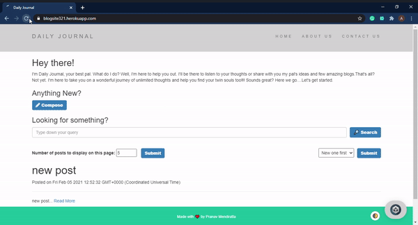

<div align="center">
  <h1>BlogSite</h1>
  
</div>

# A sneek peek into what we have here :
  
 <p align="center">
 
 </p>

## About-

<!-- ALL-CONTRIBUTORS-BADGE:START - Do not remove or modify this section -->
[](#contributors-)
<!-- ALL-CONTRIBUTORS-BADGE:END -->

- 'Blog' and 'blogging' are now loosely used for content creation and sharing on social media, especially when the content is long-form and one creates and shares content on regular basis.
<br/>

- This is a dynamically updating Blog posting website developed primarily using Node Js with EJS template engine and Mongoose as ODM(Object Data Modeling library).  [Visit BlogSite](https://blogsite321.herokuapp.com/)

## Tech Stack-
- HTML
- CSS
- EJS template engine
- Node JS
- Express JS
- Mongoose

## Environment Setup for local use -

* Drop a :star: on the GitHub repository.
<br/>

* Download and install a code/ text editor.
    - Recommended-
        - [Download VS Code](https://code.visualstudio.com/download)
        - [Download Atom](https://atom.io/)
<br/>

* Download [Node Js and npm(Node package manager)](https://nodejs.org/en/) (when you download Node, npm also gets installed by default)
<br/>

* Mongo DB community editition is free and a great software in order to work with MongoDB applications. [Download Mongo DB community editition](https://docs.mongodb.com/manual/administration/install-community/)
<br/>

* Robo 3T is a desktop graphical user interface (GUI) for Mongo DB. It can help to skip running all the Mongo DB commands manually every time we want to access the data. [Download Robo 3T](https://robomongo.org/download) **(optional)**
<br/>

* Clone the repository by running command
```
git clone https://github.com/ <your user-name> /BlogSite.git
```
in your git bash.
<br/>

* Run command `cd BlogSite`.
<br/>

* Run this command to install all dependencies for the project.
```
npm install
```

* Run this command to start the project.
```
npm run start
```

* Run this command to start the project as a developer.
```
npm run dev
```

<br/>

* Adding secret key for JWT auth.
  * Run this command when inside the root directory to make a `.env` file.
  ```
  touch .env
  ```
  * Now add this to the `.env` file
  ```
  SECRET_KEY = "AlphaVio";
  ```
<br/>

* Testing : Run this command on your terminal/ bash to start the Mongo server on port 27017(default). You need to change the url in your `app.js` file to `'mongodb://localhost:27017/blogDB'`; 

```
mongod
```
<br/>

* Run this command to start the project on local host 3000.
```
node app
```
<br/>

* Open link to view the website in your browser window if it doesn't open automatically.
```
http://localhost:3000/
```
<br/>

* You can learn more about EJS template engine and its syntax to know how we can use it inside our HTML using the [documentation](https://ejs.co/#docs)
<br/>

* Now you are all set to use this project.

#### Some useful Mongo DB commands if you are using the terminal instead of the GUI-
```
show dbs
use db <db name>
show collections
<db name> .find()
```

#### Project Deployed on Heroku : [Link](https://blogsite321.herokuapp.com/)

## Open Source Events Project is associated with:

<b>1. JGEC Winter of Code</b>

- JWoC ( JGEC Winter of Code) is a program organised by Developers JGEC in collaboration with Sristi 2020 which helps students to plunge into Open Source contribution and get the realm of Software Development.

<b>2. Mexili Winter of Code</b>

- Mexili is a Free and Open Source organization whose motivation is to funnel learning and implementation through Open Source Software Development.

<b>3. GirlScript Summer of Code</b>

- GirlScript Summer of Code is the 3 month long Open Source program  conducted by GirlScript Foundation, started in 2018, with an aim to help beginners get started with Open Source Development while encouraging diversity.

## Maintainer ✨
<table>
  <tr>
    <td align="center"><a href="https://github.com/Pranav016"><br /><sub><b>Pranav Mendiratta</b></sub></a><br /><a href="https://github.com/ALPHAVIO/BlogSite/commits?author=Pranav016" title="Code">💻</a><a href="https://github.com/ALPHAVIO/BlogSite/commits?author=Pranav016" title="Documentation">📖</a> <a href="https://github.com/ALPHAVIO/BlogSite/commits?author=Pranav016" title="Maintenance">🚧</a></td>
  </tr>
</table>

## Contributors ✨

Thanks goes to these wonderful people ([emoji key](https://allcontributors.org/docs/en/emoji-key)):

<!-- ALL-CONTRIBUTORS-LIST:START - Do not remove or modify this section -->
<!-- prettier-ignore-start -->
<!-- markdownlint-disable -->
<table>
  <tr>
    <td align="center"><a href="https://www.linkedin.com/in/anubhab-sarkar-webwriter/"><br /><sub><b>Anubhab Sarkar</b></sub></a><br /><a href="#design-anubhab1710" title="Design">🎨</a></td>
    <td align="center"><a href="https://github.com/Subhra264"><br /><sub><b>Subhra264</b></sub></a><br /><a href="https://github.com/ALPHAVIO/BlogSite/commits?author=Subhra264" title="Code">💻</a></td>
    <td align="center"><a href="http://sahilsaha.me"><br /><sub><b>Sahil Saha</b></sub></a><br /><a href="https://github.com/ALPHAVIO/BlogSite/commits?author=sahilsaha7773" title="Code">💻</a></td>
    <td align="center"><a href="https://github.com/uttu2"><br /><sub><b>uttu2</b></sub></a><br /><a href="https://github.com/ALPHAVIO/BlogSite/commits?author=uttu2" title="Documentation">📖</a></td>
    <td align="center"><a href="https://indiancovid19tracker.herokuapp.com/"><br /><sub><b>pankaj kumar bijarniya</b></sub></a><br /><a href="https://github.com/ALPHAVIO/BlogSite/commits?author=pankajkumarbij" title="Documentation">📖</a> <a href="https://github.com/ALPHAVIO/BlogSite/commits?author=pankajkumarbij" title="Code">💻</a></td>
    <td align="center"><a href="https://github.com/Niveditha18"><br /><sub><b>Niveditha Palli</b></sub></a><br /><a href="#content-Niveditha18" title="Content">🖋</a> <a href="https://github.com/ALPHAVIO/BlogSite/commits?author=Niveditha18" title="Code">💻</a></td>
    <td align="center"><a href="https://indiancovid19tracker.herokuapp.com/"><br /><sub><b>Lucky kumari</b></sub></a><br /><a href="https://github.com/ALPHAVIO/BlogSite/commits?author=luckykumarirai" title="Documentation">📖</a> <a href="https://github.com/ALPHAVIO/BlogSite/commits?author=luckykumarirai" title="Code">💻</a></td>
  </tr>
  <tr>
    <td align="center"><a href="https://kanhaiyalal.000webhostapp.com/Kanhaiya.html"><br /><sub><b>kanhaiya lal</b></sub></a><br /><a href="https://github.com/ALPHAVIO/BlogSite/commits?author=mak-ux" title="Code">💻</a></td>
    <td align="center"><a href="https://github.com/tusharjain0022"><br /><sub><b>Tushar Jain</b></sub></a><br /><a href="https://github.com/ALPHAVIO/BlogSite/commits?author=tusharjain0022" title="Documentation">📖</a> <a href="https://github.com/ALPHAVIO/BlogSite/commits?author=tusharjain0022" title="Code">💻</a></td>
    <td align="center"><a href="https://karunkarthik-portfolio.netlify.app/"><br /><sub><b>Karun Karthik</b></sub></a><br /><a href="https://github.com/ALPHAVIO/BlogSite/commits?author=karunkarthik-git" title="Code">💻</a></td>
    <td align="center"><a href="https://github.com/HarshitAditya27"><br /><sub><b>Harshit Aditya</b></sub></a><br /><a href="https://github.com/ALPHAVIO/BlogSite/commits?author=HarshitAditya27" title="Code">💻</a></td>
    <td align="center"><a href="https://aayush-hub.github.io/Aayush-Garg-Portfolio/"><br /><sub><b>Aayush Garg</b></sub></a><br /><a href="https://github.com/ALPHAVIO/BlogSite/commits?author=Aayush-hub" title="Documentation">📖</a> <a href="https://github.com/ALPHAVIO/BlogSite/commits?author=Aayush-hub" title="Code">💻</a></td>
    <td align="center"><a href="https://github.com/Abhijay007"><br /><sub><b>Abhijay Jain</b></sub></a><br /><a href="https://github.com/ALPHAVIO/BlogSite/commits?author=Abhijay007" title="Code">💻</a> <a href="https://github.com/ALPHAVIO/BlogSite/commits?author=Abhijay007" title="Documentation">📖</a></td>
    <td align="center"><a href="https://www.linkedin.com/in/cmonojit/"><br /><sub><b>Monojit Chakraborty</b></sub></a><br /><a href="https://github.com/ALPHAVIO/BlogSite/commits?author=mcmonojit" title="Code">💻</a></td>
  </tr>
  <tr>
    <td align="center"><a href="https://github.com/Ankita297"><br /><sub><b>Ankita297</b></sub></a><br /><a href="https://github.com/ALPHAVIO/BlogSite/commits?author=Ankita297" title="Code">💻</a></td>
    <td align="center"><a href="https://www.linkedin.com/in/aniket-lodh-998b34199"><br /><sub><b>Aniket Lodh</b></sub></a><br /><a href="https://github.com/ALPHAVIO/BlogSite/commits?author=aniketlodh" title="Code">💻</a></td>
    <td align="center"><a href="https://github.com/m-code12"><br /><sub><b>Monika Jha</b></sub></a><br /><a href="https://github.com/ALPHAVIO/BlogSite/commits?author=m-code12" title="Code">💻</a></td>
    <td align="center"><a href="https://vispprofile.netlify.app/"><br /><sub><b>vismitap</b></sub></a><br /><a href="https://github.com/ALPHAVIO/BlogSite/commits?author=vismitap" title="Code">💻</a></td>
  </tr>
</table>

<!-- markdownlint-restore -->
<!-- prettier-ignore-end -->

<!-- ALL-CONTRIBUTORS-LIST:END -->

This project follows the [all-contributors](https://github.com/all-contributors/all-contributors) specification. Contributions of any kind welcome!
